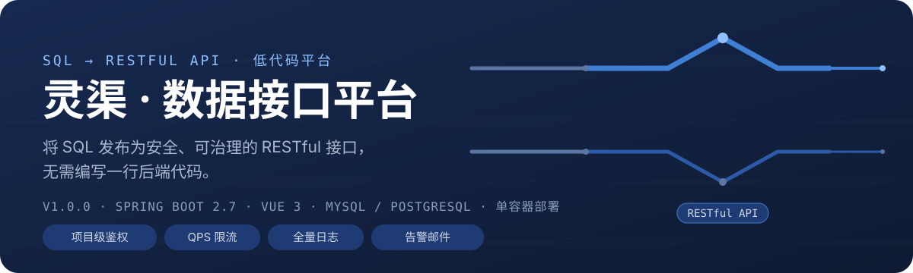
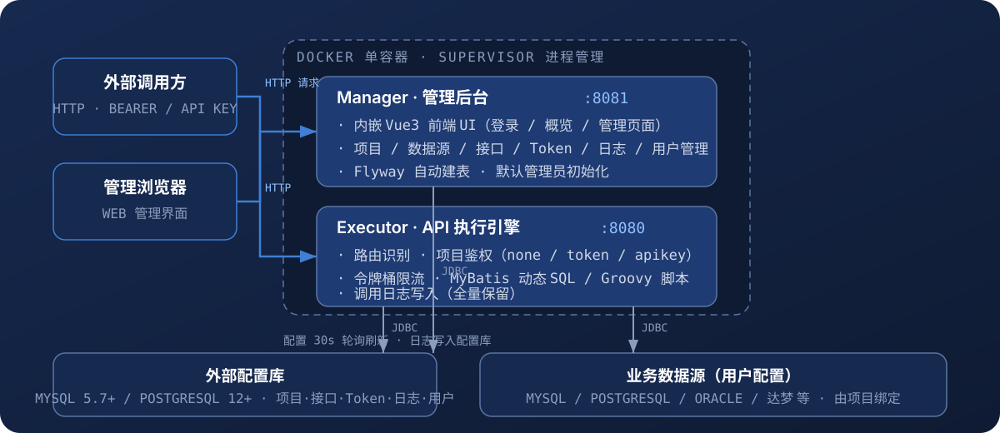

# 灵渠 · 数据接口平台（Lingqu API Platform）

<p align="center">
  
</p>

> **把 SQL 变成能安全对外提供的 RESTful API，不用写后端。**
>
> 在管理后台配置数据源、编写 SQL、一键上线，即可获得带鉴权、限流、日志与告警的稳定数据接口。多项目隔离、单容器部署、外部 MySQL/PostgreSQL 配置库，开箱即用。

---

## ✨ 特性总览

| 能力 | 说明 |
|------|------|
| **SQL → API** | 在后台编写 SQL（支持 MyBatis 动态标签），一键发布为 RESTful 接口；无需开发后端代码 |
| **多项目隔离** | 每个项目独立路由前缀、独立认证方式、独立 Token；项目间完全隔离 |
| **项目级鉴权** | `不鉴权` / `Bearer Token` / `API Key` 三种模式；Token 支持起止时间、吊销、明文按需查看 |
| **限流控制** | 接口级 QPS 令牌桶限流（Guava），超限返回 429，重启配置不丢失 |
| **调用日志** | 接口级日志开关，全字段记录调用（含客户端 IP、参数、耗时、状态码），后台可筛选查询 |
| **在线文档 / 调试** | 自动生成接口文档（路径/方法/入参/出参/curl 示例）；在线调试走真实执行链路 |
| **告警邮件** | 超时 / 错误率规则触发告警，SMTP 发送，带防抖避免重复轰炸 |
| **系统概览** | Dashboard：统计卡片、近 7 日调用趋势、项目/接口 TOP 排行、今日错误率 |
| **多用户权限** | 管理员 + 普通用户角色；用户按项目绑定权限，各看各的项目 |
| **数据源多样性** | 内置 MySQL / PostgreSQL 驱动；预留 Oracle / 达梦等驱动类配置 |

---

## 🏗️ 架构

<p align="center">
  
</p>

| 组件 | 端口 | 职责 |
|------|------|------|
| **Manager** | `8081`（默认） | Web 管理后台，内嵌 Vue3 前端静态资源；负责登录、项目/数据源/接口/Token/日志管理、用户权限、告警配置、系统概览；启动时 Flyway 自动建表并初始化默认管理员 |
| **Executor** | `8080`（默认） | 业务 API 执行引擎，合并网关职责：路由识别（首段路径匹配）→ 项目鉴权 → 限流 → SQL/Groovy 执行 → 日志写入 |
| **Supervisor** | - | 容器内进程管理，任一进程退出自动重启 |
| **外部配置库** | 外部 | MySQL 5.7+ 或 PostgreSQL 12+，存储项目、数据源、接口、Token、调用日志、用户、告警规则（应用自带全部建表脚本，无需手工建表） |
| **业务数据源** | 外部 | 用户配置的数据源（MySQL/PG/Oracle/达梦等），由项目绑定，Executor 执行 SQL 的真实目标 |

- Executor 每 **30 秒**轮询配置库，项目/接口/数据源变更自动生效（连接池按需重建）。
- 配置全部存外部数据库，**删除容器不影响数据**，升级只需重新构建镜像。

---

## 🚀 快速开始

5 步走通「创建第一个接口」。

### 1. 准备配置库

需要一台可访问的 **MySQL 5.7+** 或 **PostgreSQL 12+**，创建一个空库即可（表结构由应用自动创建）：

```sql
CREATE DATABASE lingqu DEFAULT CHARACTER SET utf8mb4 COLLATE utf8mb4_unicode_ci;
```

### 2. 启动服务

进入 `docker/` 目录，复制配置模板并填写外部库连接信息，然后构建启动：

```bash
cd docker
cp .env.example .env     # 填写 DB_* 外部数据库连接（DB_HOST 不要填 localhost）
docker compose up -d --build
```

> `.env` 含数据库密码等敏感信息，已被 `.gitignore` 排除，请勿提交到代码仓库。
> 缺少必填项时 compose 会明确报错提示，避免配置遗漏。

等待约 30 秒（首次启动自动建表 + 创建默认管理员），验证：

```bash
curl http://localhost:8081/actuator/health   # 管理端健康
curl http://localhost:8080/actuator/health   # 业务端健康
```

### 3. 登录管理后台

访问 <http://localhost:8081>，使用默认管理员登录：

- 账号：`admin`
- 密码：`123456`（可通过环境变量 `DEFAULT_ADMIN_USER` / `DEFAULT_ADMIN_PASS` 修改）

### 4. 配置数据源并上线接口

按顺序操作（导航均在左侧菜单）：

1. **数据源管理** → 新建数据源：填名称、类型、主机、端口、库名、用户名、密码 → 点「测试连接」确认连通
2. **项目管理** → 新建项目：填名称、编码、**路由前缀**（如 `/api/order`）、绑定数据源、选认证方式
3. **接口管理** → 新建接口：选项目、填接口路径（如 `/getDetail`）、编写 SQL → 点「上线」
   ```sql
   SELECT * FROM t_order WHERE order_id = #{orderId}
   ```
   > 入参定义与 SQL 参数实时联动：`#{}` 中出现的参数会自动绑定到入参表，可设置必填与默认值。

### 5. 调用接口

```bash
curl -X POST "http://localhost:8080/api/order/getDetail" \
  -H "Authorization: Bearer <你的Token>" \
  -H "Content-Type: application/json" \
  -d '{"orderId": 1001}'
```

> Token 在「项目管理 → 该项目 → Token」中生成。若项目认证方式为「不鉴权」，可直接调用。

---

## 📖 使用指南

### 项目管理

- 项目 = 一组接口的容器，拥有独立**路由前缀**（全局唯一）与**认证方式**。
- 支持：新建 / 编辑 / 启用停用 / 软删除（项目下存在已上线接口时禁止删除）。
- 每个项目可生成多个 Token，并绑定一个数据源。

### 数据源管理

- 支持 MySQL / PostgreSQL（驱动内置）；Oracle / 达梦等可手工填写驱动类名并自行添加驱动 jar。
- 密码 **AES 加密**存储，列表中不显示明文。
- 新建时只需填写：名称、类型、**主机地址、端口、数据库名称、用户名、密码**，JDBC URL 自动拼装（高级场景可覆盖）。

### 接口管理

- 生命周期：`草稿 → 上线 → 下线`；**编辑已上线接口会自动回到草稿**，需重新上线生效（生效最长 30 秒）。
- 支持出参映射：字段重命名 + `format` 日期格式化（如 `yyyy-MM-dd HH:mm:ss`）。
- 上线校验：SQL 内容非空、禁止 `${}`、入参/出参 JSON 配置合法。

#### SQL 编写约定

- 参数一律用 `#{param}`（MyBatis 参数化，**防注入**）；**禁止 `${}`**（上线与执行双重拦截）。
- 支持 MyBatis 动态标签：`<if>` `<where>` `<foreach>` `<choose>` `<set>` `<trim>` `<bind>`。
- 普通 SQL 中的 `<`/`>` 比较符无需转义（自动走静态解析）；动态 SQL 中请用 `&lt;`/`&gt;` 或 `<![CDATA[ ... ]]>`。
- 请求参数 = query 参数 + JSON body 合并为一个 Map，动态标签 `test` 直接引用参数名。
- **内置参数**（Executor 自动注入，SQL 可直接引用）：
  - `requestTime` —— 请求时间 `yyyy-MM-dd HH:mm:ss`
  - `requestTimeMillis` —— 请求时间 epoch 毫秒
- `sql_type=groovy` 时脚本可用变量：`params`（参数 Map）、`sql.query(sql, args...)`、`sql.update(sql, args...)`，返回值作为响应。

### Token 鉴权

每个项目可独立配置认证方式：

| 认证方式 | 调用时携带 |
|----------|-----------|
| `不鉴权` | 无 |
| `Bearer Token` | 请求头 `Authorization: Bearer {token}` |
| `API Key` | 请求头 `X-API-Key: {token}` |

**Token 生命周期**：

- 生成时可设置标识名称、**开始时间**（留空 = 立即生效）、**结束时间**（留空 = 永不过期）。
- 库中 AES 加密存储；需要时点击「查看明文」即可显示并复制（需项目权限）。
- 吊销后立即失效。
- 校验规则：Token 必须属于目标项目、状态有效、当前时间在 `[开始, 结束]` 区间内；任一不满足返回 401。

**常见错误**：

| HTTP | 含义 | 处理 |
|------|------|------|
| 401 | 缺少 Token / 无效 / 未到开始时间 / 已过期 / 已吊销 | 检查请求头与 Token 有效期 |
| 403 | Token 不属于该项目（跨项目使用） | 使用目标项目下生成的 Token |
| 429 | 触发限流 | 降低调用频率或调整接口 QPS |

### 在线文档与调试

- **接口文档**：按项目展示接口的路径、方法、入参、出参与 curl 调用示例，可直接复制。
- **在线调试**：填写参数后请求，走真实执行链路（Manager 转发到 Executor）；调试前需接口已上线。

### 调用日志

- 接口级日志开关；开启后每次调用记录：项目、接口、客户端 IP、请求参数、响应状态、耗时、错误信息。
- 后台「调用日志」页可按项目 / 接口 / 时间 / 状态筛选，并查看详情。

### 限流控制

- 接口级 QPS 设置（令牌桶，Guava 实现），配置每 30 秒刷新，重启不丢失。
- 超限请求返回 `429 Too Many Requests`。

### 告警邮件

- 「告警规则」中配置：超时阈值（毫秒）、错误率阈值、统计窗口、连续次数、收件人。
- 触发后通过 SMTP 发送告警邮件；带**防抖**（仅发送成功才更新触发时间，避免重复轰炸）。
- 不配置 SMTP 时告警仅记录日志、不发送。

### 多用户与权限

| 角色 | 能力 |
|------|------|
| **管理员（ADMIN）** | 全部功能：项目管理（新建/编辑/删除/启停）、数据源管理、告警规则、**用户管理** |
| **普通用户（USER）** | 仅能查看/维护**被绑定项目**的数据（接口、日志、调试、文档均按项目过滤）；可修改自己的密码 |

- 管理员在「用户管理」创建用户（初始密码 `88888888`），并**绑定可访问的项目**。
- 管理员可随时：调整项目绑定、启用/禁用账号、**重置用户密码为 `88888888`**。
- 管理员账号由环境变量固定且受保护：不可被禁用、不可被重置（只能通过环境变量改密）。

---

## 🐳 部署

### 方式一：Docker 单容器（推荐）

```bash
cd docker
cp .env.example .env      # 填写 DB_* / AES_KEY / DEFAULT_ADMIN_* 等
docker compose up -d --build
```

也可以直接用 `docker run`（更细粒度控制）：

```bash
docker run -d --name lingqu -p 8080:8080 -p 8081:8081 \
  -e DB_TYPE=mysql \
  -e DB_HOST=192.168.1.10 \
  -e DB_PORT=3306 \
  -e DB_NAME=lingqu \
  -e DB_USER=lingqu \
  -e DB_PASSWORD='你的密码' \
  -e AES_KEY='换成随机16位以上字符串' \
  -e DEFAULT_ADMIN_PASS='admin初始密码' \
  -e SMTP_HOST=smtp.example.com -e SMTP_PORT=587 \
  -e SMTP_USERNAME=alert@example.com -e SMTP_PASSWORD='xxx' \
  -e ALERT_MAIL_FROM=alert@example.com -e ALERT_MAIL_TO=ops@example.com \
  lingqu
```

### 方式二：本地开发运行

```powershell
# 1. 一键构建（前端构建 → 产物复制进 Manager → 打包两个 jar）
.\scripts\build.ps1        # Windows
./scripts/build.sh         # Linux/macOS

# 2. 设置环境变量
$env:DB_TYPE="mysql"; $env:DB_HOST="localhost"; $env:DB_PORT="3306"
$env:DB_NAME="lingqu"; $env:DB_USER="root"; $env:DB_PASSWORD="yourpass"

# 3. 启动两个进程
cd manager;  .\mvnw.cmd spring-boot:run    # 管理端 8081
cd executor; .\mvnw.cmd spring-boot:run    # 业务端 8080
```

前端开发模式（热更新，代理到 8081）：`cd frontend; npm install; npm run dev`

### 环境变量

| 变量名 | 必需 | 默认值 | 说明 |
|--------|------|--------|------|
| `DB_TYPE` | ✅ | - | `mysql` 或 `postgresql` |
| `DB_HOST` / `DB_PORT` / `DB_NAME` / `DB_USER` / `DB_PASSWORD` | ✅ | - | 外部配置库连接信息 |
| `MANAGER_PORT` | ❌ | `8081` | 管理端端口（compose 中同步控制映射） |
| `EXECUTOR_PORT` | ❌ | `8080` | 业务 API 端口（compose 中同步控制映射） |
| `JVM_OPTS_MANAGER` / `JVM_OPTS_EXECUTOR` | ❌ | `-Xms128m -Xmx256m` | 各进程 JVM 参数 |
| `DEFAULT_ADMIN_USER` / `DEFAULT_ADMIN_PASS` | ❌ | `admin` / `123456` | 首次启动自动创建的管理员 |
| `AES_KEY` | ❌ | `lingqu-aes-key-01` | AES 加密密钥（**生产必改**，Manager/Executor 必须一致，使用后不可更改） |
| `EXECUTOR_BASE_URL` | ❌ | `http://localhost:8080` | Manager 在线调试转发目标（单容器默认即可） |
| `SMTP_HOST` / `SMTP_PORT` / `SMTP_USERNAME` / `SMTP_PASSWORD` | ❌ | 空 | 告警邮件 SMTP 通道（不配置则跳过发送） |
| `ALERT_MAIL_FROM` / `ALERT_MAIL_TO` | ❌ | 空 | 告警邮件发件人 / 默认收件人 |
| `TZ` | ❌ | `Asia/Shanghai` | 容器时区（影响日志时间与告警判定） |

### 运维提示

- 容器内 Supervisor 同时拉起 Manager 与 Executor，任一进程退出自动重启。
- 配置数据全部存外部库：`docker rm` 不影响数据；升级只需重新 `docker build` + `docker run`。
- `AES_KEY` 一旦用于加密数据即不可更改，否则历史密码/Token 无法解密，请妥善保存。
- **国内服务器加速**：项目内置 Maven 多镜像源自动 failover（阿里云 → 腾讯云 → 官方 Central），npm 走 npmmirror；Docker 拉取基础镜像慢时可配置多个 registry-mirrors。

---

## 🔨 构建与开发

```powershell
# 一键构建（前端 + 后端全量）
.\scripts\build.ps1

# 单独构建
cd frontend; npm install; npm run build    # 前端产物输出到 dist/
cd manager;  .\mvnw.cmd -DskipTests package
cd executor; .\mvnw.cmd -DskipTests package
```

构建产物：`manager/target/lingqu-manager-1.0.0.jar`（内嵌前端静态资源）、`executor/target/lingqu-executor-1.0.0.jar`。

## 📁 目录结构

```
├── manager/            Manager 管理后台（Spring Boot 2.7 + MyBatis-Plus）
│   └── src/main/resources/
│       ├── db/migration/mysql/       MySQL 建表脚本（Flyway {vendor} 自动选择）
│       ├── db/migration/postgresql/  PostgreSQL 建表脚本
│       └── static/                   前端构建产物（内嵌托管）
├── executor/           Executor 执行引擎（路由/鉴权/限流/SQL 引擎）
├── frontend/           Vue 3 + Element Plus 前端工程
├── docker/             Dockerfile + supervisord.conf + entrypoint + compose（外部库模式）
├── assets/readme/      本 README 的 SVG 视觉素材
├── scripts/            build.ps1 / build.sh 一键构建
└── README.md
```

## ⚙️ 技术栈

**Spring Boot 2.7.18（Java 11）** · MyBatis-Plus 3.5 · MyBatis 动态 SQL · Flyway 8 · **Vue 3 + Element Plus + Vite** · Guava RateLimiter · Groovy · HikariCP · Supervisor · Docker

---

## 🛡️ 安全说明（重要）

- **Groovy 脚本 = 管理员级代码执行能力**（可调用 `sql` 对象执行任意参数化 SQL）。仅授予可信管理员使用；脚本内请使用 `sql.query(sql, params)` 参数化形式，勿拼接外部输入。
- SQL 一律使用 `#{}` 参数化，`${}` 在上线时与执行时双重拦截。
- 数据源密码 / Token 均 AES 加密存储；用户密码 BCrypt 哈希。
- 默认密钥/默认口令（`lingqu-aes-key-01` / `admin:123456`）仅用于开箱即用，**生产环境必须通过环境变量修改**。
- 管理端登录采用 Session 校验，生产环境建议启用 HTTPS（当前 session cookie 未强制 `Secure`）。
- `X-Forwarded-For` 用于日志记录客户端 IP，生产环境若直接暴露需自行评估伪造风险。

## ⚠️ 已知限制

1. Groovy 脚本沙箱、出参映射非日期类型格式化 为后续增强项。
2. Oracle / SQLServer / 达梦等数据源：驱动未内置，需手工填写驱动类名并自行添加驱动 jar。
3. Executor 配置刷新为 30 秒轮询（简单可靠，后续可优化为主动推送）。
4. 容器化部署需在真实 Docker 环境验证（本仓库在 CI 外验证）。

---

## ✅ 需求实现对照

| 需求 | 实现 |
|------|------|
| 3.1 项目管理 | ✅ 创建/列表/编辑/启停/软删除/数据源绑定（编码与路由前缀全局唯一） |
| 3.2 数据源管理 | ✅ CRUD + 连接测试 + 密码 AES 加密；内置 MySQL/PG 驱动，Oracle/达梦预留驱动类配置 |
| 3.3 接口管理 | ✅ CRUD + 草稿/上线/下线三态 + 动态 SQL + Groovy + 出参映射（字段重命名 + format 日期格式化） |
| 3.4 项目鉴权 | ✅ none/token/apikey + Token 起止时间/吊销/明文查看；路由首段匹配；Token 加密存储、严格绑定项目 |
| 3.5 调用日志 | ✅ 接口级开关 + 全字段记录 + 日志查询页面（项目/接口/时间/状态筛选、详情查看） |
| 3.6 限流控制 | ✅ Guava 令牌桶 + 接口级 QPS + 30s 定期刷新（重启不丢失） |
| 3.7 在线文档/调试 | ✅ 在线文档（路径/方法/入参/出参/curl 示例）+ 在线调试（走真实链路转发 Executor） |
| 3.8 系统概览/告警 | ✅ Dashboard（统计卡片 + 近 7 日趋势 + TOP 排行 + 错误率）+ 告警邮件（超时/错误率规则、防抖、SMTP） |
| 4.1 单容器部署 | ✅ Dockerfile + Supervisor + entrypoint（外部配置库模式，compose 自 .env 读取连接信息） |
| 4.2 外部配置库 | ✅ Flyway `{vendor}` 双方言自动建表 + 首次启动创建默认管理员 |
| 4.5 安全性 | ✅ 参数化查询（禁 `${}`）、AES 加密、BCrypt 哈希、Token 过期与项目隔离 |

---

## 📄 License

[](LICENSE)

本项目基于 **MIT License** 开源。

- Copyright © 2026 **Mitchll**（灵渠 · 数据接口平台 Lingqu API Platform）
- 任何人可自由使用、修改、分发与商用，仅需保留版权声明与许可声明
- 完整协议文本见 [LICENSE](LICENSE)

GitHub：[https://github.com/Mitchll1214/lingQu](https://github.com/Mitchll1214/lingQu)

